Getting Started with Azure SQL Database Elastic Scale
=======================================================================================

Growing and shrinking capacity on demand is one of the key cloud computing promises. Delivering on this promise has historically been tedious and complex for the database tier of cloud applications. Over the last few years, the industry has converged on well-established design patterns commonly known as sharding. While the general sharding pattern addresses the challenge, building and managing applications using sharding requires significant infrastructure investments independent of the application’s business logic.

Azure SQL Database Elastic Scale (in preview) enables the data-tier of an application to scale in and out via industry-standard sharding practices, while significantly streamlining the development and management of your sharded cloud applications. Elastic Scale delivers both developer and management functionality which are provided through a set of .Net libraries and Azure service templates that you can host in your own Azure subscription to manage your highly scalable applications. Azure DB Elastic Scale implements the infrastructure aspects of sharding and thus allows you to focus on the business logic of your application instead.

In this lab, you will be introduced to the developer experience for Azure SQL Database Elastic Scale.

This lab includes the following tasks:

* [Creating a Microsoft Azure SQL Database Server](#creating-a-sql-server)
* [Walking through the sample](#walking-through-the-sample)
* [Appendix - Cleanup](#cleanup)

## Creating a Microsoft Azure SQL Database Server ##

In this task you will create a new Microsoft Azure SQL Database Server and configure the firewall so that connections from applications running on your computer are allowed to access the databases on your SQL Database server.

1. Sign in to the [Management Portal](http://manage.windowsazure.com).

1. On the sidebar, click **SQL DATABASES**. Then click the **SERVERS** tab. 

	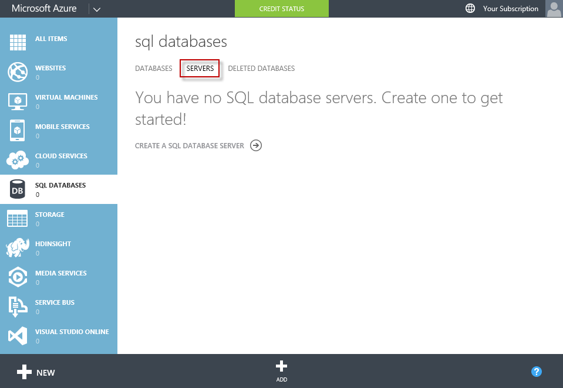

	_Navigating to the SQL Database Server tab_

1. Click **ADD** in the bottom bar in order to create a new SQL Database Server.

	

	_Adding a new SQL Database Server_

1. In the **CREATE SERVER** dialog box, fill out the Server Settings as follows:

	* **Login Name**: enter an administrator name as one word with no spaces. SQL Database uses SQL Authentication over an encrypted connection to validate user identity. A new SQL Server authentication login that has administrator permissions will be created using the name you provide. The administrator name cannot be a Windows user, nor should it be a Live ID user name. Windows authentication is not supported on SQL Database.

	* **Login Password**: provide a strong password that is at least eight characters, using a combination of upper and lower case values, and a number or symbol. Use the help bubble for details about password complexity.

	* **Region**: choose a region. The region determines the geographical location of the server. Regions cannot be easily switched, so choose one that makes sense for this server. Keeping your Azure application and database in the same region saves on egress bandwidth cost and data latency.

	* Be sure to keep the **Allow Azure Services to access this server**  checkbox selected so that you can connect to this database using the Management Portal for SQL Database, Excel in Office 365, or Azure SQL Reporting.

	Finally, click the checkmark button at the bottom of the dialog box to create the server. 

	Notice that you did not specify a server name. Because the SQL Database server must be accessible worldwide, SQL Database configures the appropriate DNS entries when the server is created. The generated name ensures that there are no name collisions with other DNS entries. You cannot change the name of your SQL Database server.

	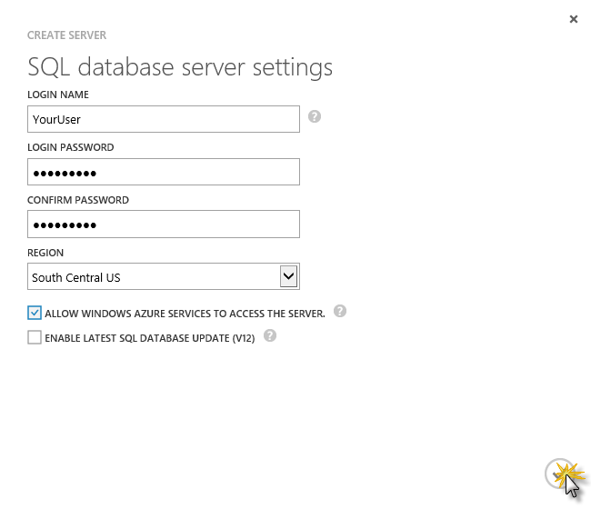

	_Creating a new SQL Database Server_

1. Wait until the server has been created. You will see a notification like the one below and also an entry added to the **SQL databases** page.

	

	_SQL Database Server created_

	Now you will configure the firewall so that connections from applications running on your computer are allowed to access the databases on your SQL Database server.

	To configure the firewall so that connections are allowed through, you will enter information on the server page. 

	> **Note:** The SQL Database service is only available with TCP port 1433 used by the TDS protocol, so make sure that the firewall on your network and local computer allows outgoing TCP communication on port 1433. For more information, see [SQL Database Firewall](http://social.technet.microsoft.com/wiki/contents/articles/2677.sql-azure-firewall-en-us.aspx).

1. Click the server you just created to open the server page.

	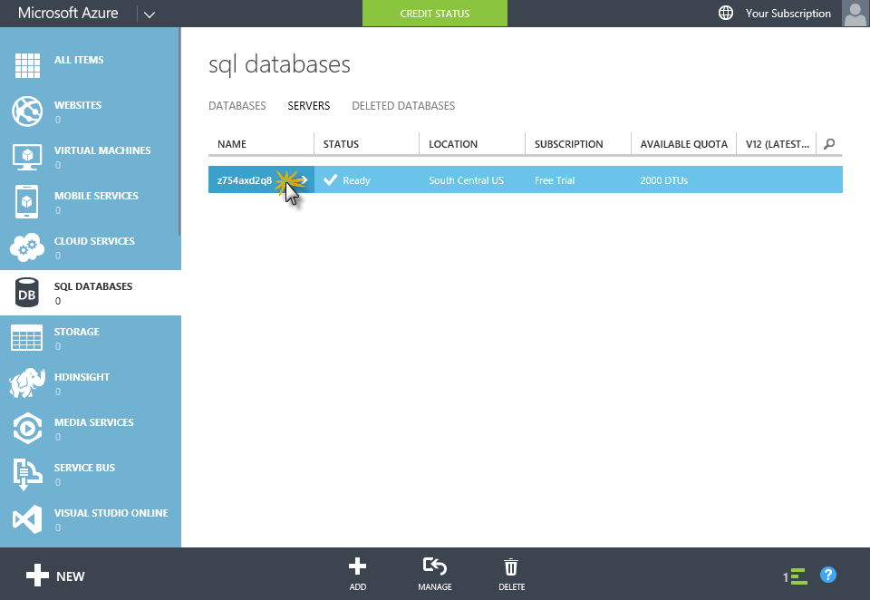

	_Navigating to the new server page_

1. On the server page, click **Configure** to open the **Allowed IP Addresses** settings. Then click **Add to the allowed IP Addresses** link. 

	This will create a new firewall rule to allow connection requests from the router or proxy server your device is listening on.

	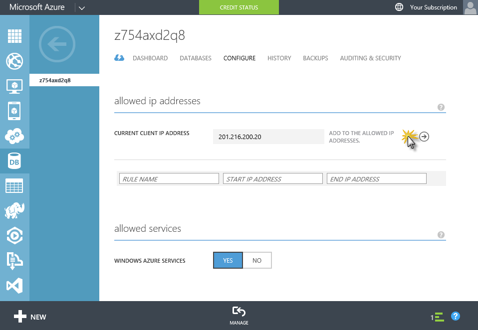

	_Adding a firewall rule to the server_

	> **Note:** You can create additional firewall rules by specifying a rule name and the start and end IP range values.

1. To save your changes, click **SAVE** at the bottom of the page.

	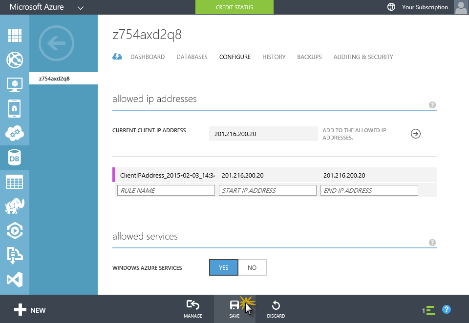

	_Saving the allowed ip changes_

1. Take note of the name of the SQL Database server (e.g.: _z754axd2q8_), as you will need it in the following task.

You now have a SQL Database server on Azure, a firewall rule that enables access to the server, and an administrator login.

## Walking through the sample ##

The **Elastic Scale with Azure SQL Database - Getting Started** sample application illustrates the most important aspects of the development experience for sharded applications using Azure SQL DB Elastic Scale. It focuses on key use cases for [Shard Map Management](http://go.microsoft.com/?linkid=9862595), [Data Dependent Routing](http://go.microsoft.com/?linkid=9862596) and [Multi-Shard Querying](http://go.microsoft.com/?linkid=9862597). 

In this task, you will download and run this sample. 

1. Open Visual Studio and select **File -> New -> Project**.

	

	_Creating a new project_

1. In the _New Project_ dialog box, click **Online**.

	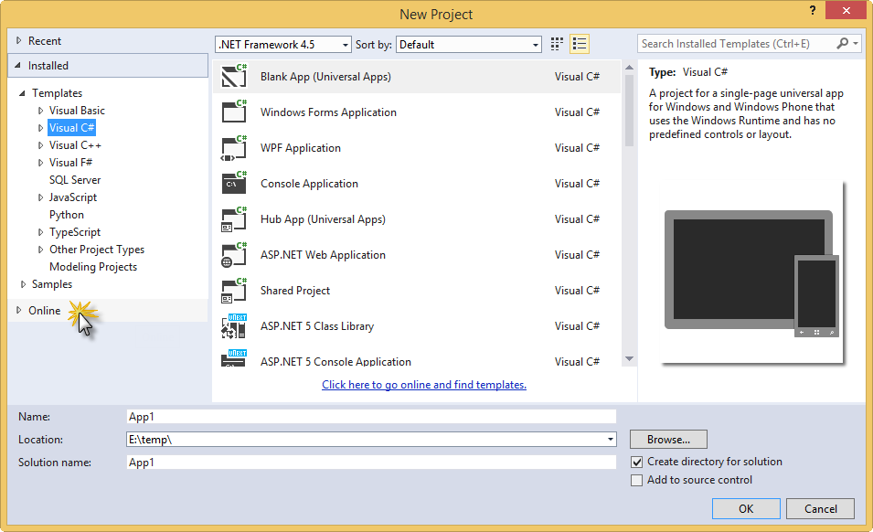

	_Clicking Online_

1. Then click **Visual C#** under **Samples**.

	

	_Navigating to online C# samples_

1. In the search box, type **Elastic Scale** to search for the sample. The title **Elastic Scale with Azure SQL Database-Getting Started** appears.
 
1. Select the sample, choose a name and a location for the new project and click **OK** to create the project.

	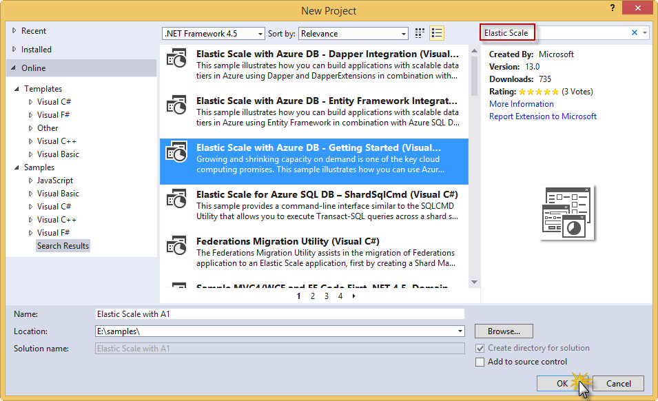

	_Creating the sample project_

1. If the **Download and Install** dialog comes up, click **Install**.

	

	_Clicking Install in the Download and Install dialog_

1. Open the **App.config** file in the solution for the sample project and replace the _MyServerName_ placeholder with your Azure SQL database server name and the _MyUserName_ and _MyPassword_ placeholders with your login information (user name and password).

	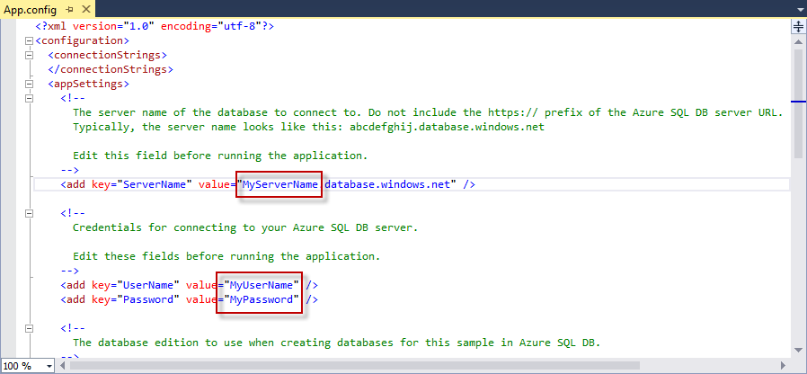

	_Configuring the sample project_

1. Build and run the application. If asked, please allow Visual Studio to restore the NuGet packages of the solution. This will download the latest version of the Elastic Scale client libraries from NuGet.

	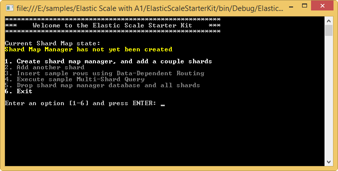

	_Running the sample_

1. In the application, type **1** and press **_enter_** in order to create the shard map manager and add several shards.

	> **Note:**  The code illustrates how to work with shards, ranges, and mappings in file **ShardMapManagerSample.cs**. You can find more information about this topic here: [Shard Map Management](http://go.microsoft.com/?linkid=9862595).

	The output will look like this:

	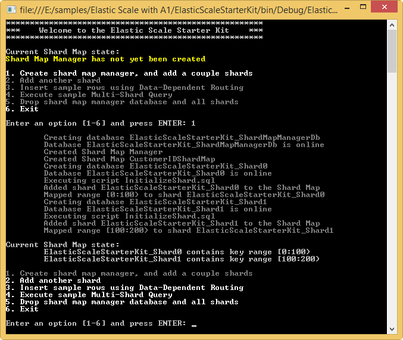

	_Creating the shard map manager and adding several shards_

1. Switch to the [Management Portal](http://manage.windowsazure.com), navigate to the SQL Database server page and click the **DATABASES** tab.

	Notice that you have three new databases: the shard manager and one for each shard.

	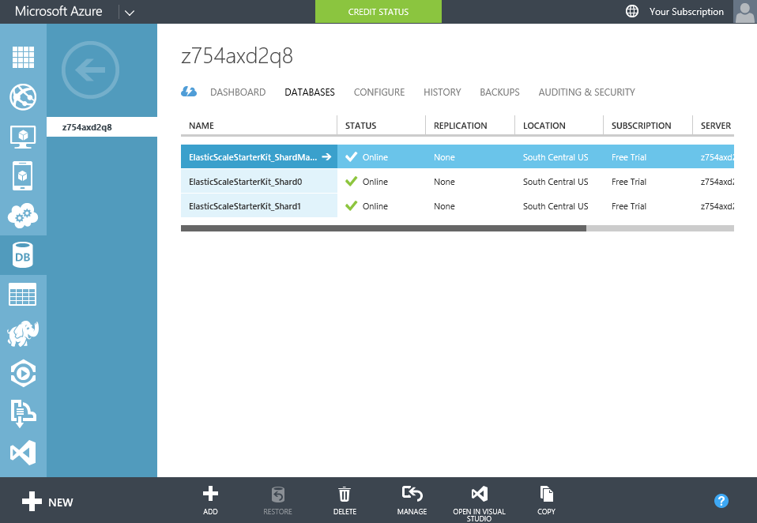

	_Navigating to the SQL Database server page_

1. Switch back to the application, type **3** and then press **_enter_**. This will insert a sample row using Data-Dependent routing.

	> **Note:** Routing of transactions to the right shard is shown in **DataDependentRoutingSample.cs**. For more details, see [Data Dependent Routing](http://go.microsoft.com/?linkid=9862596). 

	

	_Inserting sample row_

1. Repeat the last step at least three more times so that you have at least four rows.

1. Now, type **4** and press **_enter_** in the application to execute a sample Multi-Shard Query.

	Notice the _$ShardName_ column. It should show that the rows with a _CustomerId_ from 0 to 99 are located in the _ElasticScaleStarterKit_Shard0_ shard and those with a _CustomerId_ from 100 to 199 are located in the _ElasticScaleStarterKit_Shard1_ shard.

	> **Note:** Querying across shards is illustrated in the file **MultiShardQuerySample.cs**. For more information, see [Multi-Shard Querying](http://go.microsoft.com/?linkid=9862597).

	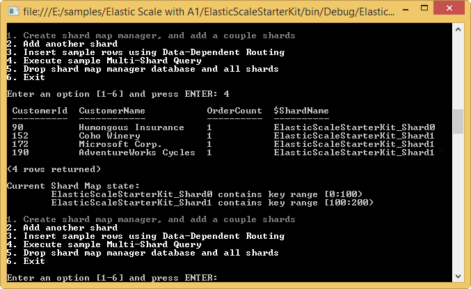

	_Executing a Multi-Shard Query_

1. Type **2** and press **_enter_** in the application to add another shard. When prompted for the higher key of the new range, press **_enter_** to use the default value of _300_.

	> **Note:** The iterative adition of new empty shards is performed by the code in
file **AddNewShardsSample.cs**. For more information see [Shard Map Management](http://go.microsoft.com/?linkid=9862595).

	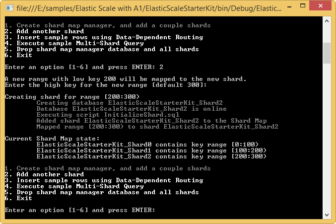

	_Adding a new shard_

1. Switch back to the **Management Portal**. You should see a new database for the new shard named _ElasticScaleStarterKit_Shard2_.

	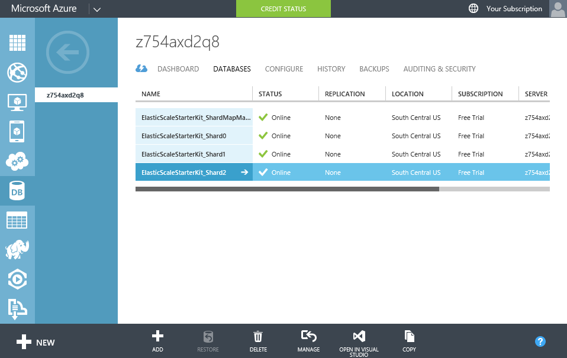

	_Viewing the new database in the portal_

1. Switch back to the application, type **5** and press **_enter_**. This will drop all the shards and the map manager database.

	

	_Removing the shards and the map manager_

1. Stop debugging.

You have successfully built and run your first Elastic Scale application on Azure SQL DB. You can find information on other Elastic Scale operations in the following links:

* **Splitting an existing shard**: The capability to split shards is provided through the **Split/Merge service**. You can find more information about this service here: [Split/Merge Service](http://go.microsoft.com/?linkid=9862795).

* **Merging existing shards**: Shard merges are also performed using the **Split/Merge service**. For more information, see [Split/Merge Service](http://go.microsoft.com/?linkid=9862795). 

##Appendix - Cleanup

In this task you will learn how to delete the SQL Database Server created in the first task.

1. Sign in to the [Management Portal](http://manage.windowsazure.com).

1. On the sidebar, click **SQL DATABASES**. Then click the **SERVERS** tab. 

1. Click the row for the server you created to select it and then click **DELETE** from the bottom bar.

1. In the confirmation dialog that appears, type the server name and the click the check mark button.

_Delete server confirmation dialog_

The server will be deleted. Once it is done you should see a notification in the bottom bar.

##Summary

By completing this lab you have learned the basic concepts of Azure SQL Database Elastic Scale: Shard Map Management, Data Dependent Routing and Multi-Shard Querying.
